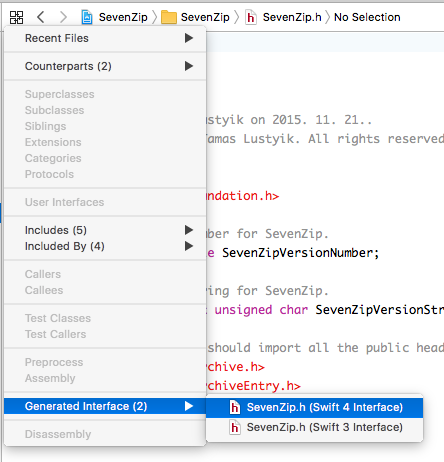

# Bridgecraft

Bridgecraft (homophone for "witchcraft") is a command line tool for generating the Swift interface for ObjC bridging headers. This comes handy if you have a mixed Swift-ObjC codebase and you want to use code generation tools (e.g. [Sourcery](https://github.com/krzysztofzablocki/Sourcery)) that only support Swift.

### How it works

Xcode already supports generating a Swift interface for any ObjC source file:



Unfortunately, this functionality tends to be flaky to the point that one cannot rely on it. Another disadvantage is that it is not exposed on the CLI and so it's rather difficult to use it in an automated manner.

Bridgecraft reproduces the steps needed for the interface generation with some additional safeguards to provide a reliable output, namely:

1. creates a copy of the given project
2. extracts the bridging header build setting for the given target
3. modifies the target to include a dummy source that references the bridging header
4. captures the relevant flags for compiling the dummy
5. preprocesses the dummy by expanding macros and includes (this is where the Xcode command usually fails)
6. taps into SourceKit and generates the Swift interface

### Usage

You can invoke Bridgecraft from the shell:

```
$ Bridgecraft.app/Contents/MacOS/Bridgecraft <path_to_xcodeproj> <target_name>
```

The generated interface will appear on the standard output.

### Requirements

To build: Xcode 9.2, Swift 4, Carthage<br/>
To run: macOS 10.10

### Caveats and known issues

- Preprocessing throws away all `NS_ASSUME_NONNULL` macros which would result in implicitly unwrapped optionals all over the place. To circumvent that, use the `--assume-nonnull` option but make sure all the referenced headers have previously been audited for nullability.

### License

MIT